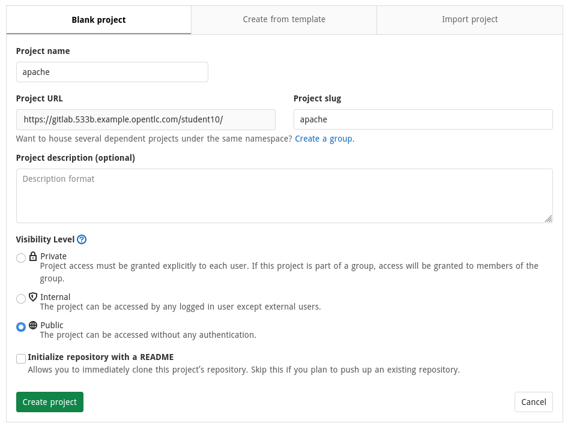

# Exercise - Ansible Tower as part of a CI/CD pipeline

We are going to use our Install Apache example again but integrate it with our CI/CD pipeline to automatically deploy our website.

## Create gitlab repository

Select **Create Project**


Name the project **apache** and make sure the repository is set to **public**



Finally, click **clone** and then copy the **Clone with HTTPS** by clicking on the clipboard icon next to **Clone with HTTPS**.


## Creating our playbook

As your student user, log onto ansible-1 and clone the repo

```bash
cd ~
git clone https://gitlab.533b.example.opentlc.com/student10/apache.git
Cloning into 'apache'...
warning: You appear to have cloned an empty repository.
```

We are going to re-create the Install Apache playbook and push this to our git repo. Change directory to the newly cloned apache directory.

```bash
cd ~/apache
```

Create the playbook ~/apache/apache.yml with the following contents:

```bash
---
- name: Apache server installed
  hosts: web
  become: yes
  tasks:
  - name: latest Apache version installed
    yum:
      name: httpd
      state: latest
  - name: Apache enabled and running
    service:
      name: httpd
      enabled: true
      state: started
  - name: copy web.html
    copy:
      src: web.html
      dest: /var/www/html/index.html
```

Next create a directory for the index.html:

```bash
mkdir ~/apache/files
```

Finally, create ~/apache/files/web.html 

```bash
<body>
<h1>Automating is fun</h1>
</body>
```

Quickly run the playbook to make sure it works:

```bash
ansible-playbook apache.yml
```

## Push the playbook to git

Now that we know the playbook works, we can push it to git. 

```bash
cd ~/apache
git add .
git commit -m "initial commit"
git push
```

If you check the gitlab repository in your web browser, you should now see your files.


## Create playbook to configure Ansible Tower

Now that we have our playbook, we are going to write a second playbook that will create the necessary objects in Ansible Tower to allow us to execute our job. As the student user on the ansible-1 create a directory for the Tower configuration:

```bash
mkdir ~/apache/tower_config
```

Now create a playbook that will define a new project with this new gitlab repository, define the job template and finally launch the job. The playbook should be called  ~/apache/tower_config/tower.yml and contain the following:

**NOTE - update the tower_git_url the https url you used to clone the gitlab repository**

```bash
--- 

- name: Create Ansible job and launch it
  hosts: localhost
  gather_facts: false
  vars:
    tower_project_name: "apache project"
    tower_organization: Default
    tower_git_url: changeme!!!!!
    tower_inventory: "Workshop Inventory"
    tower_job_name: "CI Apache Install"
    tower_playbook_name: apache.yml
    tower_become_enabled: true
    tower_host_limit: web
    tower_credentials:
      - "Workshop Credential"
  tasks:
  - name: Create Project in Ansible Tower
    awx.awx.tower_project:
      name: "{{ tower_project_name }}"
      organization: "{{ tower_organization }}"
      scm_type: git
      scm_clean: true
      scm_delete_on_update: true
      scm_update_on_launch: false
      scm_url: "{{ tower_git_url }}"
      state: present

  - name: Update Project in Ansible Tower
    awx.awx.tower_project_update:
      project: "{{ tower_project_name }}"

  - name: Create Job Template in Ansible Tower
    awx.awx.tower_job_template:
      name: "{{ tower_job_name }}"
      job_type: "run"
      organization: "{{ tower_organization }}"
      inventory: "{{ tower_inventory }}"
      project: "{{ tower_project_name }}"
      playbook: "{{ tower_playbook_name }}"
      limit: "{{ tower_host_limit }}"
      become_enabled: "{{ tower_become_enabled }}"
      credentials: "{{ tower_credentials }}"
      state: "present"

  - name: Launch Job Template in Ansible Tower
    awx.awx.tower_job_launch:
      job_template: "{{ tower_job_name }}"
      wait: true
```

## Test the playbook

Make sure you still have your Tower environment variables set so we can authenticate to the Tower API (replace **yourpassword** with the correct password):

```bash
export TOWER_USERNAME=admin && export TOWER_PASSWORD=yourpassword && export TOWER_VERIFY_SSL=false
```

```bash
ansible-playbook tower_config/tower.yml
```

Check in the Tower UI to see the objects we have created. The **CI Apache Install** job should have run succesfully. If it has then push your changes to git.

## Push changes to git

```bash
cd ~/apache
git add .
git commit -m "Add Tower playbook"
git push
```

## Summary

We have now looked at four different ways of interacting with Ansible Tower todo the same thing - launch a job. The UI, directly with the API, Tower CLI and finally the Ansible Tower modules. This gives users the flexibility to consume the Ansible Automation Platform in the way that best suits their use-case. In the next lab we are going to look at a more complete example and how we can configure larger parts of Ansible Tower with the Ansible modules.

---

[Click Here to return to the Ansible Tower Workshop](../README.md)
