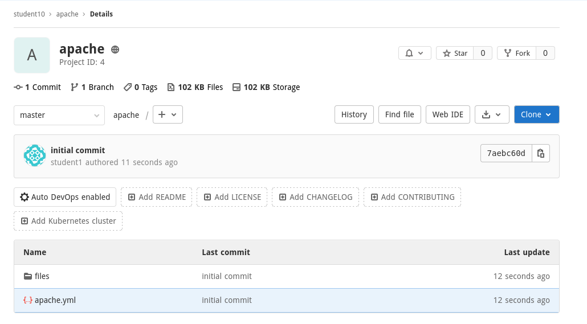
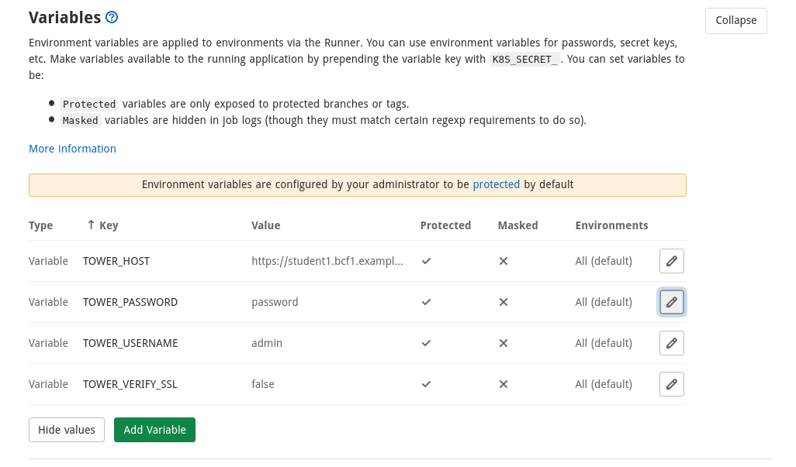
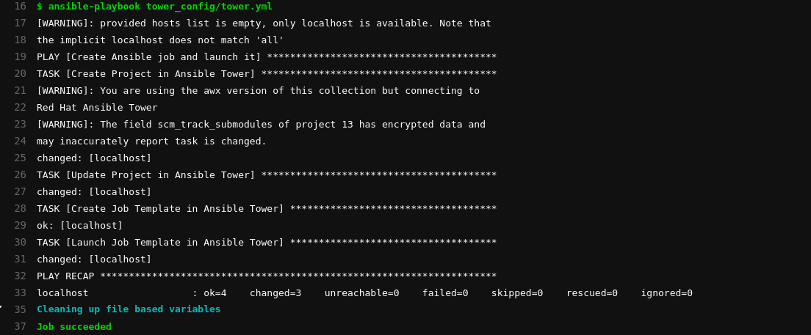
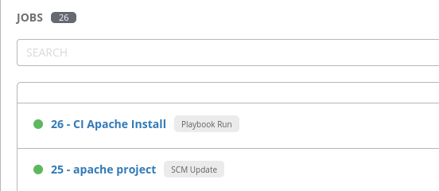

# Exercise - Ansible Tower as part of a CI/CD pipeline

We are going to use our Install Apache example again but integrate it with our CI/CD pipeline to automatically deploy our website.

## Create a gitlab repository

Select **Create a Project**


Name the project **apache** and make sure the repository is set to **public**


Finally, click **Clone** and then copy the **Clone with HTTPS** by clicking on the clipboard icon next to **Clone with HTTPS**.


## Creating our playbook

As your student user, log onto ansible-1 and clone the repo

```bash
cd ~
git clone https://gitlab.533b.example.opentlc.com/student10/apache.git
```

Output:

```bash
Cloning into 'apache'...
warning: You appear to have cloned an empty repository.
```

We are going to re-create the Install Apache playbook and push this to our git repo. Change directory to the newly cloned apache directory.

```bash
cd ~/apache
```

Create the playbook ~/apache/apache.yml with the following contents:

```bash
---
- name: Apache server installed
  hosts: web
  become: yes
  tasks:
  - name: latest Apache version installed
    yum:
      name: httpd
      state: latest
  - name: Apache enabled and running
    service:
      name: httpd
      enabled: true
      state: started
  - name: copy web.html
    copy:
      src: web.html
      dest: /var/www/html/index.html
```

Next create a directory for the index.html:

```bash
mkdir ~/apache/files
```

Finally, create ~/apache/files/web.html 

```bash
<body>
<h1>Automating is fun</h1>
</body>
```

Quickly run the playbook to make sure it works:

```bash
ansible-playbook apache.yml
```

## Push the playbook to git

Now that we know the playbook works, we can push it to git. 

```bash
cd ~/apache
git add .
git commit -m "initial commit"
git push
```

If you check the gitlab repository in your web browser, you should now see your files.



## Create a playbook to configure Ansible Tower

Now that we have our playbook, we are going to write a second playbook that will create the necessary objects in Ansible Tower to allow us to execute our job. As the student user on the ansible-1 create a directory for the Tower configuration:

```bash
mkdir ~/apache/tower_config
```

Now create a playbook that will define a new project with this new gitlab repository, define the job template and finally launch the job. The playbook should be called  ~/apache/tower_config/tower.yml and contain the following:

**NOTE - update the tower_git_url the https url you used to clone the gitlab repository**

```bash
--- 

- name: Create Ansible job and launch it
  hosts: localhost
  gather_facts: false
  vars:
    tower_project_name: "apache project"
    tower_organization: Default
    tower_git_url: changeme!!!!!
    tower_inventory: "Workshop Inventory"
    tower_job_name: "CI Apache Install"
    tower_playbook_name: apache.yml
    tower_become_enabled: true
    tower_host_limit: web
    tower_credentials:
      - "Workshop Credential"
  tasks:
  - name: Create Project in Ansible Tower
    awx.awx.tower_project:
      name: "{{ tower_project_name }}"
      organization: "{{ tower_organization }}"
      scm_type: git
      scm_clean: true
      scm_delete_on_update: true
      scm_update_on_launch: false
      scm_url: "{{ tower_git_url }}"
      state: present

  - name: Update Project in Ansible Tower
    awx.awx.tower_project_update:
      project: "{{ tower_project_name }}"

  - name: Create Job Template in Ansible Tower
    awx.awx.tower_job_template:
      name: "{{ tower_job_name }}"
      job_type: "run"
      organization: "{{ tower_organization }}"
      inventory: "{{ tower_inventory }}"
      project: "{{ tower_project_name }}"
      playbook: "{{ tower_playbook_name }}"
      limit: "{{ tower_host_limit }}"
      become_enabled: "{{ tower_become_enabled }}"
      credentials: "{{ tower_credentials }}"
      state: "present"

  - name: Launch Job Template in Ansible Tower
    awx.awx.tower_job_launch:
      job_template: "{{ tower_job_name }}"
      wait: true
```

## Test the playbook

Make sure you still have your Tower environment variables set so we can authenticate to the Tower API (replace **yourpassword** with the correct password):

```bash
export TOWER_USERNAME=admin && export TOWER_PASSWORD=yourpassword && export TOWER_VERIFY_SSL=false
```

```bash
ansible-playbook tower_config/tower.yml
```

Check in the Tower UI to see the objects we have created. The **CI Apache Install** job should have run succesfully. If it has then push your changes to git.

## Push changes to git

```bash
cd ~/apache
git add .
git commit -m "Add Tower playbook"
git push
```

## Integrate with Gitlab CI/CD

We are going to use Gitlab CI/CD as part of this lab. A Gitlab Runner has already been provisioned. Create a Gitlab CI file called **~/apache/.gitlab-ci.yml** with the following contents:

```bash
stages:
  - tower

Configure tower and Execute Job:
  tags:
    - ansible
  stage: tower
  except: 
    changes:
      - .gitlab-ci.yml
  script:
    - ansible-playbook tower_config/tower.yml
```

This is a really basic example which will launch our playbook to configure Ansible Tower and then launch our job. The pipeline will run everytime we make a change except to the .gitlab-ci.yml file.

Push the newly created Gitlab CI file to git:

```bash
cd ~/apache
git add .
git commit -m "Add Gitlab CI file"
git push
```

Because we are ignore the Gitlab CI file, we shouldn't see any CI jobs starting.

## Add Tower variables to Gitlab CI

Previously, we have set environment variables from the command line to allow us to authenticate to Ansible Tower. For example we set TOWER_USERNAME and TOWER_PASSWORD. We are going to set these in Gitlab CI now. 

In the Gitlab UI make sure you are in your **apache** repository. In the left-hand menu go to **Settings** and then **CI/CD**.

Expand the **Variables** section and add the following variables by clicking **Add Variable**. 

**NOTE: Your Tower Password and Tower Hostname are available in your workbench information**

<table>
  <tr>
    <th>Key</th>
    <th>Value</th>
  </tr>
  <tr>
    <td>TOWER_USERNAME</td>
    <td>admin</td>
  </tr>
  <tr>
    <td>TOWER_PASSWORD</td>
    <td>yourpassword</td>
  </tr>
  <tr>
    <td>TOWER_HOST</td>
    <td>yourtowerhostname</td>
  </tr>
  <tr>
    <td>TOWER_VERIFY_SSL</td>
    <td>false</td>
  </tr>
</table>

You should see something similar to this when you are finished:





## Testing our CI configuration

We should have everything in place now. Let's edit our web.html file and see if our CI pipeline automatically deploys our changes via Ansible Tower.

Edit **~/apache/files/web.html** and update your message to something like this:

```bash
<body>
<h1>Deployed with Gitlab CI</h1>
</body>
```

Commit the changes and push them to git:


```bash
cd ~/apache
git add .
git commit -m "Updating my website"
git push
```

In the Gitlab UI make sure you are in your **apache** repository. In the left-hand menu, select **CI/CD** and then **Pipelines**.


You can click on the **Passed** button to view the details for the job.



Next, we can login to the Ansible Tower UI to verify that the project was updated and that the job ran succesfully. In the left-hand menu in Ansible Tower select **Jobs**.



Finally, browse to one of your webservers to make sure you see your new index.html. Reminder that you can find the IP of your web servers by looking in the inventory in Ansible Tower - **Inventories** -> **Workshop Inventory** -> **Hosts** and then click on one of the nodes to see the IP address.

## Summary

In this lab we have leveraged the Ansible modules for Ansible Tower to configure more objects. Using this approach you can fully configure and deploy Ansible Tower in a completely automated way using the Ansible language.

We have also taken what we have learned in previous labs to integrate Ansible Tower with our CI/CD pipeline. This allows us to consume the Ansible Tower API to deploy our infrastructure with all of the relevant auditing and controls in place without having to re-invent the wheel.

---

[Click Here to return to the Ansible Tower Workshop](../README.md)
